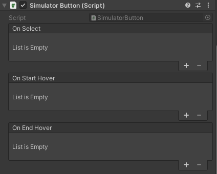

# VR Interface Text - Overall description
This project contains a custom VR interface simulation made from scratch for keyboard and mouse. This interface is showcase by an item management system. This system contains :
- Pickup system (items on the floor that the user can get by interacting with a controller)
- Container system (items where pickups can be dropped)
- Inventory system (menu that you can navigate with the controller to store or get items)
- Items categories (inventory and containers will only accept certain types of items)

# Controls
You can control both the camera and the controllers but not at the same time. Controls change depending on what you are currently controlling.

* Camera controls
    - WASD/ZQSD/Arrow Keys: Move warp line, that indicates to which position the user can warp to
    - Mouse: Rotate the camera to look around
    - Left click: When warp line is active, warps the user to the target position

* Controller controls
    - WASD/ZQSD/Arrow Keys: Move the controller around on its local X and Y axis
    - Mouse wheel: Move the controller along its local z axis
    - Mouse: Rotate the controller, allowing the user to control where it is pointing (controllers both have a line renderer indicating where they are pointing)
    - Left click: If a selectable item is hovered (shown by the controller pointer changing color), select it (the effect depends on the type of object it is)

* Shared controls
    - Tab: Switch control between camera and controllers (camera then left controller then right then back to camera)
    - I Key: Open or closes inventory

You can quit the game by opening the inventory and clicking on the button "quit application"

# Simulator interactables
The VR interface is simulated through the Simulated Controllers. Each time they are moved or rotated (when the user is currently controlling one), they will check with a raycast the line in front of them. If the ray return an interactable object, it will be stored and selected if the user presses the Select input.
These objects will only get detected if they have the "Interactable" layer. The layer mask used by the controllers can be set in their inspector.

Simulator interactabled are built like buttons, they have events called when a controller starts and end being pointed at them and one when the user presses the select input while hovering an interactable.

If you want to create an interactable specific behaviour through code, you can create a new classe inheriting from SimulatorInteractable and override the Select method (you don't need to call OnSelect yourself in the Select method, it is already handled by the controller). 

If you want to set this behaviour in the editor, you can just add methods to the events in any class inheriting from SimulatorInteractable in the inspector.
